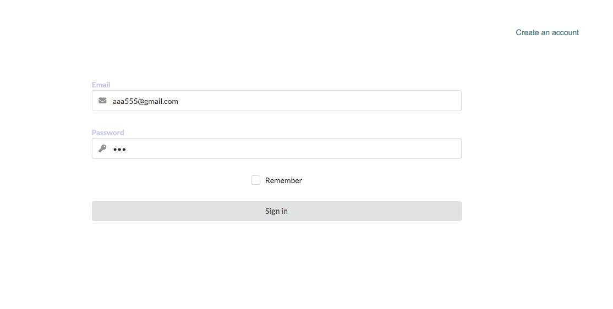
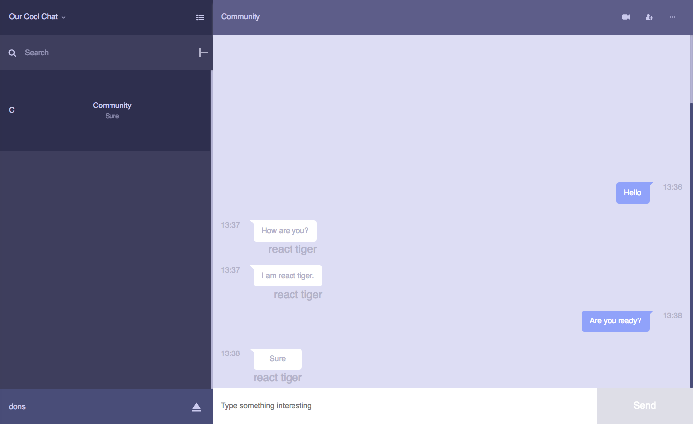

## Example of basic team collaboration system on MeanStack

This is an team chat application for team collaboration written in MeanStack.   
You can create an account and sign in with email or tokens.  

## Install  
```
git https://github.com/Dream222/MERNstackApp.git
cd MERNstackApp
npm install
```

## Backend:
	
* Node.js
* Express.js
* MongoDB
* bcrypt
* Socket

## Frontend:

* React.js
* Redux 
* Semantic UI

## Prerequisites

You will need the following resources properly installed on the machine.


* [Git](https://git-scm.com)
* [Node.js](https://nodejs.org) (with NPM)
* [MongoDB](https://www.mongodb.com)

### Start API server  
API server is going to start on port 4002
```
npm run start_server
```

### Start React  
React is going to start on port 3000
```
npm run start_react
```

You can check at http://localhost:3000  


### Login


### Chat



### You need MongoDB. Here's an example of installing MongoDB on mac os X  

```
brew update   
brew install mongodb  
mkdir mongodb_data  
mongod --dbpath mongodb_data/  
```

## License  
MIT. You can do whatever you want.  
